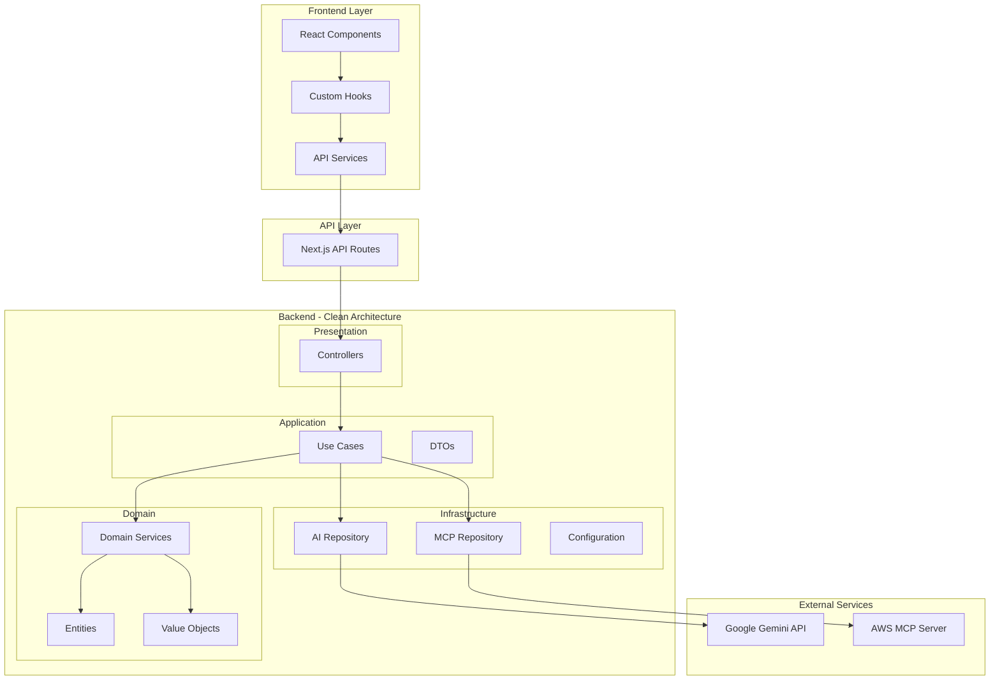

# El Profesor - AI Education Assistant

[](https://nextjs.org/) [](https://www.typescriptlang.org/) [](https://tailwindcss.com/) [](https://ai.google.dev/) [](LICENSE)

A professional AI education assistant built with Next.js, featuring Google Gemini integration, image generation, AWS knowledge base, and clean architecture principles.

## 🚀 Key Features

### Core Capabilities
- **🤖 Multi-Model AI Chat** - Gemini 2.5 Flash Lite/Flash/Pro with streaming responses
- **🎨 AI Image Generation** - Create and edit images with Gemini 2.5 Flash Image
- **🎯 Custom Instructions** - Personalize AI behavior with system prompts

### Advanced Controls
- **🌡️ Fine-tuning** - Temperature and Top-P controls for response customization
- **📚 AWS Integration** - Real-time access to AWS documentation via MCP server
- **⚡ Real-time Streaming** - Server-sent events for smooth user experience
- **📱 Responsive Design** - Mobile-friendly interface with modern UI

### Technical Excellence
- **🏗️ Clean Architecture** - Domain-Driven Design with SOLID principles
- **🔧 Professional Structure** - Scalable and maintainable TypeScript codebase
- **🧪 Type Safety** - Full TypeScript coverage with strict mode

## 🏗️ Architecture Overview



## 🚀 Quick Start

### Prerequisites
- **Node.js** v20 or higher
- **Google AI API Key** from [Google AI Studio](https://makersuite.google.com/app/apikey)

### Installation

```bash
# Clone and install
git clone <your-repo-url>
cd el-profesor
npm install

# Environment setup
cp .env.local.example .env.local
# Add your GOOGLE_API_KEY to .env.local

# Start development server
npm run dev
```

Visit [http://localhost:3000](http://localhost:3000) to start using El Profesor.

## 🎯 Available Models

| Model | Purpose | Performance | Use Case |
|-------|---------|-------------|----------|
| **Gemini 2.5 Flash Lite** | Text Chat | ⚡ Fastest | Quick responses, general queries |
| **Gemini 2.5 Flash** | Text Chat | ⚖️ Balanced | Complex reasoning, detailed analysis |
| **Gemini 2.5 Pro** | Text Chat | 🧠 Most Capable | Advanced reasoning, complex tasks |
| **Gemini 2.5 Flash Image** | Image Generation | 🎨 Creative | Text-to-image, image editing |

## 🎨 Image Generation

### Capabilities
- **Text-to-Image** - Create images from descriptive prompts
- **Image Editing** - Modify existing images conversationally
- **Multiple Formats** - Support for various aspect ratios (1:1, 16:9, 9:16, etc.)
- **Professional Quality** - High-resolution outputs suitable for production use

### Example Usage
```typescript
// Generate a professional logo
"A minimalist logo for a tech startup called 'CloudFlow' with clean typography and a subtle cloud icon, black and white design"

// Create photorealistic images
"A photorealistic close-up portrait of a wise owl wearing tiny glasses, sitting in a cozy library filled with ancient books, soft golden lighting"
```

## 🌡️ Advanced Controls

### System Prompts (Custom Instructions)
Define AI personality and behavior:

```typescript
// Built-in templates
"👨‍💻 Coding Assistant" // Clear code examples and explanations
"☁️ AWS Expert"         // AWS services and architecture guidance
"🎓 Patient Teacher"    // Simple, educational explanations
```

### Response Fine-tuning
- **Temperature (0.1-1.0)** - Controls creativity vs. consistency
- **Top-P (0.1-1.0)** - Controls response variety and focus
- **Quick Presets** - Factual, Balanced, Creative modes

## 📚 AWS Knowledge Integration

Real-time access to AWS documentation through MCP (Model Context Protocol):

### Features
- **Automatic Context** - AWS queries automatically enhanced with official documentation
- **Live Documentation** - Always up-to-date information from docs.aws.amazon.com
- **Smart Search** - Intelligent search across all AWS services
- **Regional Data** - Service availability and regional information

### Integration Status
✅ **Fully Operational** - Connected to AWS Knowledge MCP Server with 5 active tools

## 🛠️ Development

### Available Scripts
```bash
npm run dev        # Start development server
npm run build      # Build for production
npm run start      # Start production server
npm run lint       # Run ESLint
npm run type-check # TypeScript validation
```

### Project Structure
```
src/app/
├── backend/                 # Clean Architecture Backend
│   ├── domain/             # Business logic, entities, value objects
│   ├── application/        # Use cases, DTOs
│   ├── infrastructure/     # External services, repositories
│   └── presentation/       # Controllers, API interfaces
├── frontend/               # React Frontend
│   ├── components/         # UI components
│   ├── hooks/             # Custom React hooks
│   └── services/          # API communication
├── api/                   # Next.js API routes
├── chat/                  # Chat interface page
└── image/                 # Image generation page
```

### API Endpoints
- `POST /api/chat/message` - Send chat messages with streaming support
- `GET /api/chat/models` - Get available AI models
- `POST /api/image/generate` - Generate images from text prompts
- `GET /api/chat/status` - System health and MCP status

## 🚀 Deployment

### Environment Variables
```bash
GOOGLE_API_KEY=your_google_api_key_here
NODE_ENV=production
```

### Build & Deploy
```bash
npm run build
npm run start
```

## 🔧 Configuration

### Request Format
```typescript
interface ChatRequest {
  message: string;
  model?: string;
  systemPrompt?: string;
  temperature?: number;    // 0.1-1.0, default: 0.7
  topP?: number;          // 0.1-1.0, default: 0.9
  useStreaming?: boolean;
}
```

## 📄 License

MIT License - see [LICENSE](LICENSE) file for details.

## 🤝 Contributing

1. Fork the repository
2. Create a feature branch (`git checkout -b feature/amazing-feature`)
3. Commit your changes (`git commit -m 'Add amazing feature'`)
4. Push to the branch (`git push origin feature/amazing-feature`)
5. Open a Pull Request

## 🆘 Support

### Common Issues
- **API Errors** - Verify `GOOGLE_API_KEY` is correctly set
- **Build Errors** - Run `npm run type-check` for TypeScript issues
- **Quota Limits** - Check Google AI Studio for usage and billing

### Debug Mode
```bash
DEBUG=* npm run dev
```

---

Built with ❤️ using Next.js, TypeScript, and Google Gemini AI